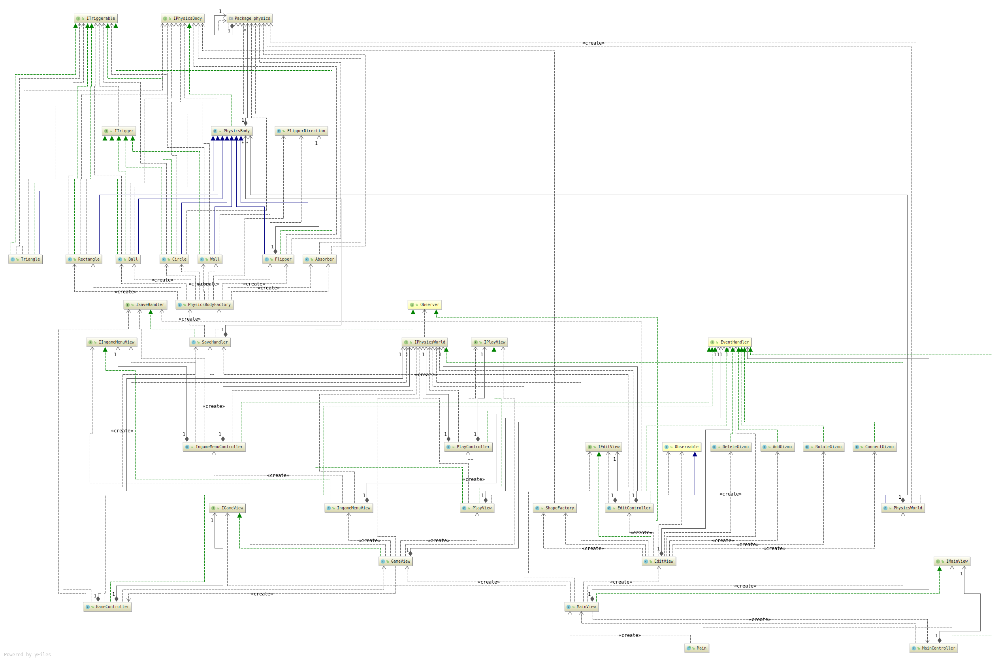
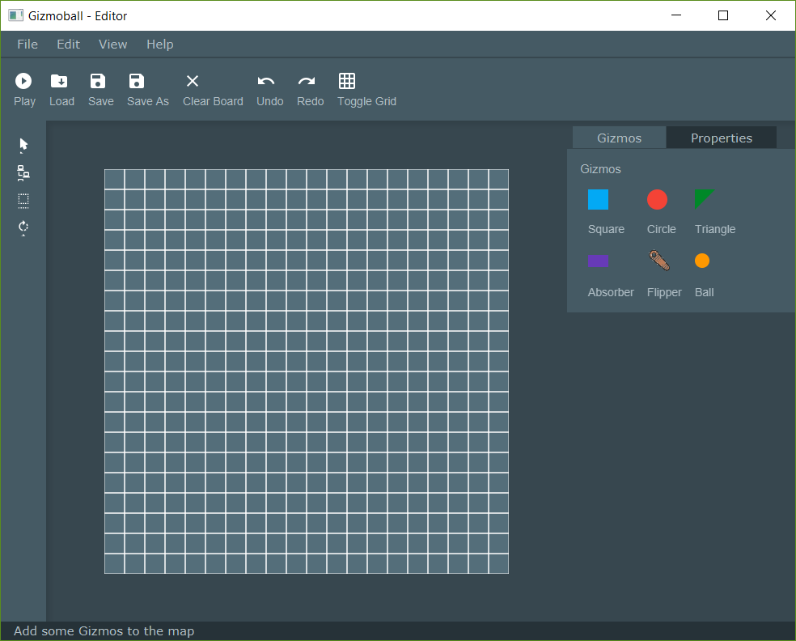
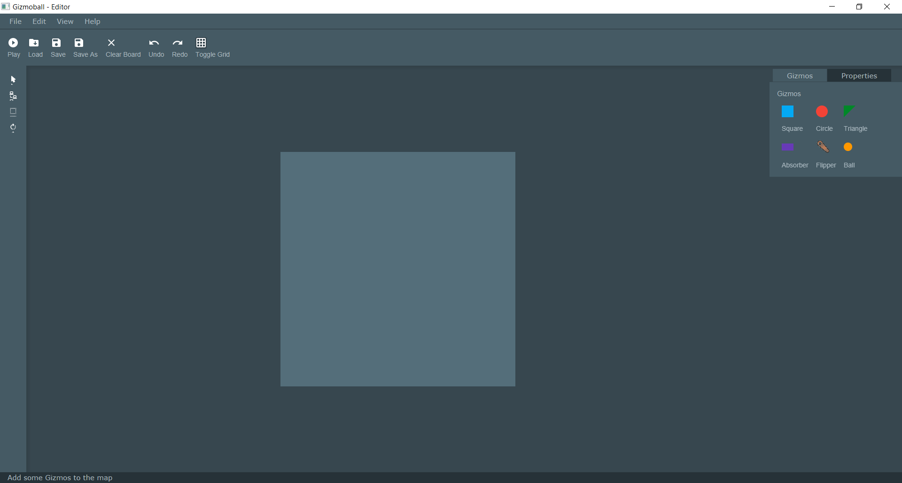
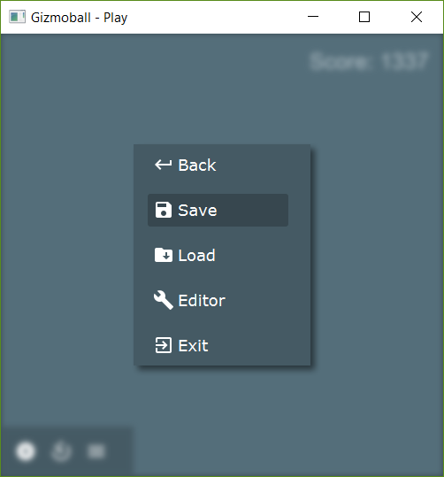
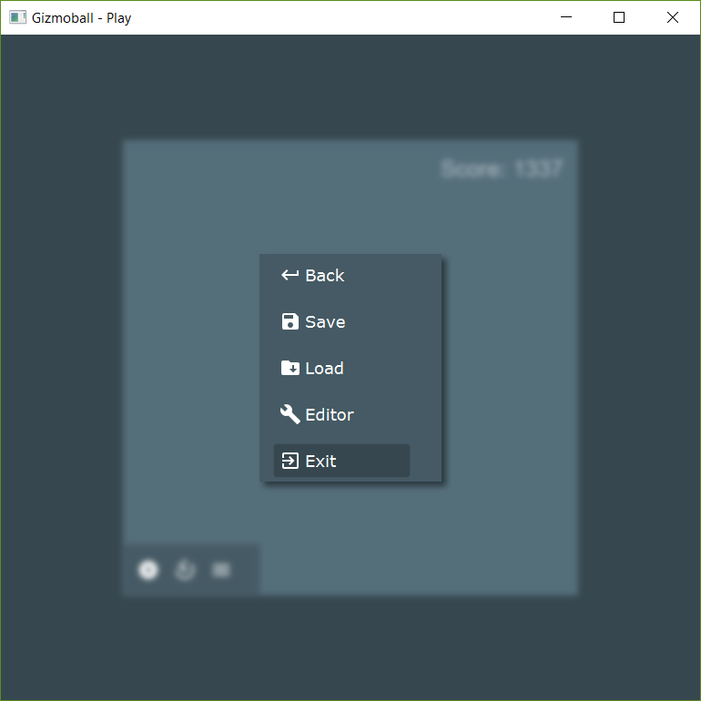
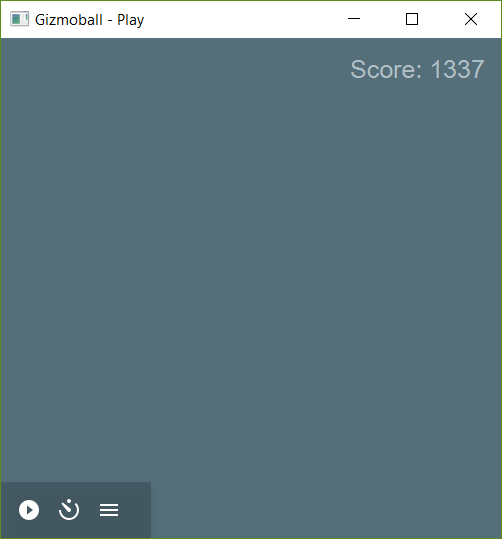
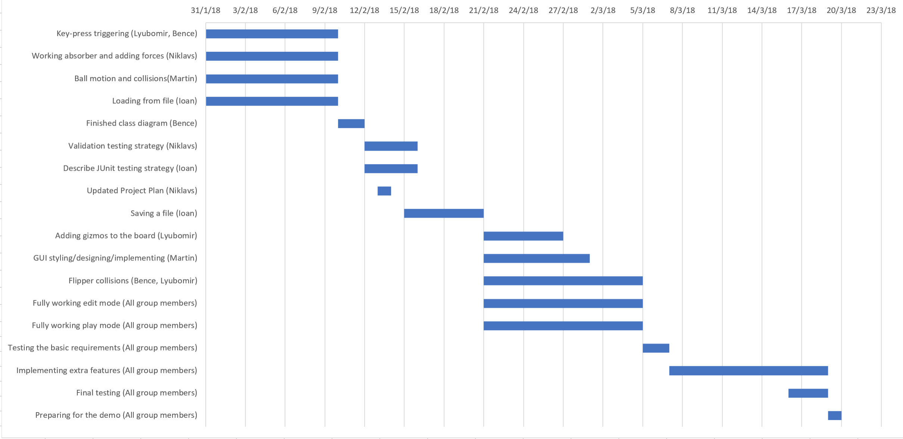

# Preliminary Design 

**Gizmoball** is an arcade game very similar to pinball. The aim is to keep a ball moving around the playing area and not let it touch an absorber (usually placed at the bottom) using different types of gizmos. Gizmos [^1] can be static objects, such as circles, squares and triangles or flippers which can hit the ball if it is within their reach. The final system would include a graphical user interface with two modes - editor mode and play mode. Below is the list of revised specifications in each mode: 

[^1]: Gizmos include squares, circles, triangles, absorbers and flippers.

## Group Members

**Group:** PR_Th1

Bence Sebestyen @xsb15143

Ioan Luca @xqb16141

Lyubomir Ivanov @kwb15150

Martin Kollie @vib15168

Niklavs Meiers @isb15151


## Table of Contents

<!-- toc -->

* [Revised Specification](#revised-specification)
  * [Editor mode](#editor-mode)
  * [Play mode](#play-mode)
* [Use cases](#use-cases)
  * [Add Gizmos](#add-gizmos)
  * [Add Absorber](#add-absorber)
  * [Remove Gizmo](#remove-Gizmo)
  * [Connect Gizmos](#connect-gizmos)
  * [Clear playing area](#clear-playing-area)
  * [Adding a new ball](#adding-a-new-ball)
  * [Move Gizmo](#move-Gizmo)
  * [Rotate Gizmo](#rotate-Gizmo)
  * [Save configuration](#save-configuration)
  * [Load configuration](#load-configuration)
  * [Stop game](#stop-game)
  * [Run game](#run-game)
* [Physics loop (high level)](#physics-loop-high-level)
* [Triggering System](#triggering-system)
  * [ITriggarable](#itriggarable)
  * [ITrigger](#itrigger)
  * [Rationale](#rationale)
* [Class diagram](#class-diagram)
  * [View hierarchy](#view-hierarchy)
  * [Main](#main)
  * [ShapeFactory](#shapefactory)
  * [MainView](#mainview)
  * [EditView](#editview)
  * [GameView](#gameview)
  * [PlayView](#playview)
  * [IngameMenuView](#ingamemenuview)
  * [View Interfaces](#view-interfaces)
  * [MainController](#maincontroller)
  * [EditController](#editcontroller)
  * [Edit area states](#edit-area-states)
  * [GameController](#gamecontroller)
  * [PlayController](#playcontroller)
  * [IngameMenuController](#ingamemenucontroller)
  * [EventHandler](#eventhandler)
  * [IPhysicsBody, ISaveHandler, IPhysicsWorld](#iphysicsbody-isavehandler-iphysicsworld)
  * [ITriggerable](#itriggerable)
  * [ITrigger](#itrigger)
  * [SaveHandler](#savehandler)
  * [PhysicsBodyFactory](#physicsbodyfactory)
  * [PhysicsWorld](#physicsworld)
  * [PhysicsBody](#physicsbody)
  * [Absorber](#absorber)
  * [Ball](#ball)
  * [Circle](#dot)
  * [Flipper](#flipper)
  * [FlipperDirection](#flipperdirection)
  * [Rectangle](#rectangle)
  * [Triangle](#triangle)
  * [Wall](#wall)
* [GUI screenshots](#gui-screenshots)
* [Project Plan](#project-plan)
* [Appendix](#appendix)

<!-- tocstop -->

## Revised Specification 

### Editor mode
- Initialise an empty area where the layout can be built

- Re-configure an already constructed layout 

- Add any chosen type of Gizmo to the playing area 

- Add a ball to the playing area, specifying its position 

- Move an existing ball to a different position

- Edit the velocity and the diameter of an existing ball

- Remove a ball from the playing area

- Set custom values for gravity and friction

- Move a Gizmo from one cell to another  

- Rotate a Gizmo 90° clockwise  

- Remove a selected Gizmo from the playing area 

- Connect gizmos together (link a certain Gizmo's trigger to the action of another Gizmo) 

- Make a key press trigger a particular Gizmo's action 

- Save the configurations to a file 

- Load particular configurations from a file and display it on the screen 

- Go to play mode 

- Clear playing area

- Exit the application 


### Play mode

- Start a game (release the ball in the playing area) 

- Stop a game (stop the ball in its current position) 

- Press keys that trigger gizmos' actions 

- Save the current state of a stopped game  

- Load and display a saved game state 

- Go to editor mode 

- Exit the application 


## Use cases


### Add Gizmos

**Precondition:**  Editor mode enabled

**Trigger:** Gizmo type selected from the gizmos panel

**Path:**

1. The `20L x 20L` layout grid becomes highlighted.

2. The status label informs the user that he needs to select one grid location.

3. The user selects a grid square from the layout by clicking it.

4. If the grid square is occupied by another Gizmo, go to `3`.
. The status label informs the user that he can now add more gizmos of the same type animated for 2 seconds, go to `2`.

**Postcondition:** One or more gizmos of the same type have been added to the layout.


### Add Absorber

**Precondition:** Editor mode enabled

**Trigger:** Absorber shape selected from the gizmos panel

**Path:**

1. The `20L x 20L` layout grid becomes highlighted.

2. The status label informs the user that he needs to select one grid location representing the right top corner of the absorber.

3. The user selects a grid square from the layout by clicking it.

4. If the grid square is occupied by another Gizmo, go to `3`.

5. The status label informs the user that he needs to select one grid location representing the left bottom corner of the absorber, do `3 - 4`and go to `6`.

6. The status label informs the user that he can now add more gizmos of the same type, go to `2`.

**Postcondition**: One or more absorbers of the same type have been added to the layout.


### Remove Gizmo

Or an already existing ball 

**Precondition:** Editor mode enabled

**Trigger:** Gizmo selected

**Path:**

1. User clicks delete button.

2. Gizmo is removed from the grid layout.

**Postcondition:** The grid layout does not contain the removed Gizmo.


### Connect Gizmos

Connects a Gizmo trigger to a Gizmo action

**Precondition:** Editor mode enabled

**Trigger:** Connect switch has been toggled

**Path:**

1. The user selects a Gizmo from the grid, the Gizmo then becomes highlighted. If the Gizmo 
cannot trigger then notify the user through the status label, go to `1`.

1. The user selects a second Gizmo from the grid which then becomes highlighted in a different way. If the selected Gizmo
doesn't have an action then notify the user through the status label, go to `2`.

**Postcondition:** The first Gizmo's trigger is now connected to the second Gizmo's action.


### Clear playing area

**Precondition:** Editor mode enabled and at least one edit action performed

**Trigger:** "Clear Board" button selected

**Path:**

1. User clicks the "Clear Board" button

1. All gizmos are removed from the playing area

**Postconditions:** All gizmos are cleared from the grid layout. Physics properties 
like gravity and friction are preserved.


### Adding a new ball

Placing a new ball in the playing area 

**Precondition:** Editor mode enabled, a ball does not exist in the current grid layout

**Trigger:** "New ball" button clicked 

**Path:**

1. The user enters values in the input fields for the velocity (0L/sec to 200L/sec), diameter (default is 0.5L) 
or chooses to go with the default values. [^4]

1. The user selects a grid location to place the ball at. If the grid location
is occupied, go to `2`, else go to `4`. If The user clicks on an absorber go to `3`.

3. The ball is placed in the right bottom corner of the absorber. 

4. The properties panel shows up and the user can adjust the velocity by dragging a slider. 

**Postcondition:** A new ball is now added to the playing area.

[^4]: Ball velocity ranges from `0L/sec` to `200L/sec`.


### Move Gizmo

**Precondition:** Editor mode selected 

**Trigger:** "Move Gizmo" button clicked 

**Path:**

1. User clicks on the Gizmo to be moved 

2. User drags Gizmo to the new location 

3. If location is already occupied go to step `2`. 

**Postcondition:** Gizmo has changed its location;


### Rotate Gizmo

**Precondition:** Editor mode enabled 

**Trigger:** Rotate button has been toggled 

**Path:**

1. The user clicks on a Gizmo.

1. If the Gizmo doesn't support rotation, go to `1`.

1. The selected Gizmo rotates 90 degrees clockwise.

1. Go to `1`.

**Postcondition:** The Gizmo/gizmos that the 
user clicked on have been rotated by `n * 90` degrees
clockwise, where `n` is the number of clicks 
on each Gizmo.


### Save configuration 

**Precondition:** Editor mode selected  

**Trigger:** "Save" button selected  

**Path:**

1. A file explorer that only shows Gizmoball files pops up.

1. The user selects the desired location and clicks "Save".  

1. If saving fails, notify the user and then go to `1`.

1. A status label shows that the game configurations have been successfully saved.

**Postcondition:** Game configuration has been saved to a Gizmoball file on the disk.


### Load configuration 

**Trigger:** "Load" button clicked  

**Path:**

1. A file picker that only shows gizmoball files pops up.

1. The user selects the desired file and clicks "Load".

1. If loading fails, notify the user, go to `1`.

1. Game configurations are loaded and displayed on the screen.

1. The status label shows that the game configurations have been successfully loaded.

**Postcondition:** The saved playing area is shown ready for further editing.


### Stop game 

**Precondition:** Play mode selected, the game is running. 

**Trigger:** “Stop” button pressed. 

**Path:**

1. User presses “Stop” button. 

2. The game has been stopped and the main menu appears on the screen.

**Postcondition**: Ball stops (game has been paused). Main menu displayed on the screen.


### Run game 

**Precondition:** Play mode enabled, the game has been stopped or new game has been loaded. 

**Trigger:** “Run” button pressed 

**Path:**

1. User presses “Run” button 

2. The ball starts to move with the previous velocity and direction. 

**Postcondition:** Game is running, play mode enabled.


## Physics loop (high level)

```
for every tick  
    
    # The method that does the calculation also returns an object that the ball will collide next.
    Calculate collision time for all gizmos (and balls if added) inside the map.
    
    # Time until next frame is drawn
    if estimated time until nearest collision > 0.05 seconds then
        Set balls new coordinates where the ball will be after this time passes
        Apply gravity and friction for that time period. 
    
    if time until next collision < 0.05 then
        update the coordinates of the ball
        calculate and set the velocity of the ball after the collision
        
        # Calls the triggered() method on the object returned by calculating collisions method   
        if Gizmo that ball collides with have trigger then
           trigger the action
    
    Notifies the observers (redraws the screen)
```

    
## Triggering System

### ITriggarable
 * An interface that describes the ability of gizmos to perform an action when they are triggered.
 
### ITrigger
 * An interface that describes the ability of gizmos to trigger other gizmos, calling their actions. 
 * In a system where all the gizmos can trigger, then an `AbstractGizmo` class can implement this interface. 
 * Alternatively, the interface can be implemented by particular concrete Gizmo implementations so that this ability remains specific to
only a few gizmos.

### Rationale

Not all the gizmos have to be `Itriggarable` and not all the gizmos need to be `ITrigger`.

Every `Itrigger` needs to mantain a `Set<Itriggerable> toBeTriggeredGizmos` as part of their implementation.
However, this set can be empty as a trigger may not have any triggarable elements connected to it.

<<<<<<< HEAD
As part of the strath.cs308.gizmoball.model, a `Set<Itrigger> hitByBallTriggers` will contain all the triggers that can call actions 
on other gizmos when the ball collides with them. In the physics loop, whenever the ball collides with a gizmo,
if the gizmo is part of the `hitByBallTriggers` set, then the `trigger()` method of it is called. Internally, the 
=======
As part of the model, a `Set<Itrigger> hitByBallTriggers` will contain all the triggers that can call actions 
on other gizmos when the ball collides with them. In the physics loop, whenever the ball collides with a Gizmo,
if the Gizmo is part of the `hitByBallTriggers` set, then the `trigger()` method of it is called. Internally, the 
>>>>>>> master
`trigger()` method will call the `doAction()` method of every `Itriggarable` in the `toBeTriggeredGizmos` set.

In addition, a `Map<Key, ITriggarable> keyStrokeToITriggarable` such that 
when a key is hit by the user, `keyStrokeToItriggarable.get(key).doAction()` is called.

The `doAction()` method can be implemented in various ways for different concrete implementations
of gizmos such that flippers can flip, absorbers can shoot the ball upwards, circles can change color etc.


## Class diagram



### View hierarchy

Some view contains sub-views.
Each view has its own interface.
Each view has its own controller class.
The view Controllers only handle the events
fired from the actual view and not from it's sub-views.

* Main view
    * Game view
        * Play view
        * Ingame menu view
    * Edit view

### Main
This class is the starting point of the FX application.

### ShapeFactory
This class is responsible to create the representation of a `PhysicalBody` on the view.

### MainView
This is where the main window and those elements that are presented in all view
are implemented.

### EditView
Contains the UI implementation of the editing mode.

### GameView
Contains the UI implementation of the play mode.
Build up by the PlayView and the InGameMenuView.

### PlayView
This is where the game is presented by drawing out the PhyisicalWorld.
This is also an Observer to the PhysicalWorld, to make sure it's always
representing the current state of the world.
 
### IngameMenuView
This class implementing the menu which can be brought up while the user
is playing in play mode.

### View Interfaces
IEditView, IGameView, IIngameMenuView, IMainView, IPLayView.
These interfaces are for hiding the actual implementations of the view from
the other part of the application.
Controller -> View

### MainController
This is an implementation of EventHandler interface.
This class required to handle all the events caused by interaction with the MainView.

### EditController
This is an implementation of EvnetHandler interface.
This class handles all the event coming from the EditView.
And also changing the state of the editing area.

### Edit area states
AddEntity, AddGizmo, ConnectGizmo, DeleteGizmo, RotateGizmo.
These event handlers specifying that how the edit area should behave in the given state
which was set by the EditController (trough an interaction of the EditView).
This contains clicking and drawing events.

### GameController
This controller handles the events coming from the GameView.
And just the GameView itself.

### PlayController
Handles the user interaction with the playing area of the game mode view.

### IngameMenuController
This controller's task is to respond to the events generated by the
play modes in-game menu.

### EventHandler
Interface from the javafx package.
Main purpose to hide controller implementation and provide
a bridge between Controllers and Views.
View -> Controller.

### IPhysicsBody, ISaveHandler, IPhysicsWorld
This three interface meant to represent the Model in another part
of the application, also hiding the implementation behind them.
View -> Model
Controller -> Model

### ITriggerable
This interface provides details for those objects
which can be triggered by triggers.

### ITrigger
This interface provides unified functions across all trigger objects
to be able to link triggerable objects to itself which can be triggered by
the trigger objects.

### SaveHandler
This class purpose to handle the config file IO operations.

### PhysicsBodyFactory
Factory for generating proper object representation from
strings which are contained in the config files.

### PhysicsWorld
The PhysicsWorld class meant to coordinate a world which is built up by PhysicsBody.
This is where the physics loop takes place.
This class is an Observable class, which meant to provide a way for the Model
to communicate with another part of the application
Model (Observable) -> View (Observer) //Mainly in our case.

### PhysicsBody
Abstract class which provides the implementation of the common
traits of an entity which meant to be placed in our game world
and used in physics simulation.

### Absorber
The entity class which represents an Absorber Gizmo with all its own
functionality and traits.
Subclass of the PhysicsBody.

### Ball
The entity class for the game ball.
Subclass of the PhysicsBody.

### Circle
Class for Circle Gizmo representation in our Model.
Subclass of the PhysicsBody.

### Flipper
Representation of the Flippers in our Model.
Single flipper class used for both left and right flipper.
The difference between the two was separated with the
FlipperDirection enum class.
Subclass of the PhysicsBody.

### FlipperDirection
Enum class for representing the possible flipper directions.

### Rectangle
Class for modeling the rectangle Gizmo.
Subclass of the PhysicsBody.

### Triangle
Class for modeling the triangle Gizmo.
Subclass of the PhysicsBody.

### Wall
Class in the strath.cs308.gizmoball.model for representing the walls which are 
building up the boundaries of the physical world's boundaries.
Subclass of the PhysicsBody.

## GUI screenshots

### Editor Mode






### Play Mode








## Project Plan

| Tasks                                              | Start Date | Duration (days) |
|----------------------------------------------------|------------|-----------------|
| Key-press triggering (Lyubomir, Bence)             | 1/31/2018  | 10              |
| Working absorber and adding forces (Niklavs)       | 1/31/2018  | 10              |
| Ball motion and collisions(Martin)                 | 1/31/2018  | 10              |
| Loading from file (Ioan)                           | 1/31/2018  | 10              |
| Finished class diagram (Bence)                     | 2/10/2018  | 2               |
| Validation testing strategy (Niklavs)              | 2/12/2018  | 4               |
| Describe JUnit testing strategy (Ioan)             | 2/12/2018  | 4               |
| Updated Project Plan (Niklavs)                     | 2/13/2018  | 1               |
| Saving a file (Ioan)                               | 2/15/2018  | 6               |
| Adding gizmos to the board (Lyubomir)              | 2/21/2018  | 6               |
| GUI styling/designing/implementing (Martin)        | 2/21/2018  | 8               |
| Flipper collisions (Bence, Lyubomir)               | 2/21/2018  | 12              |
| Fully working edit mode (All group members)        | 2/21/2018  | 12              |
| Fully working play mode (All group members)        | 2/21/2018  | 12              |
| Testing the basic requirements (All group members) | 3/5/2018   | 2               |
| Implementing extra features (All group members)    | 3/7/2018   | 12              |
| Final testing (All group members)                  | 3/16/2018  | 3               |
| Preparing for the demo (All group members)         | 3/19/2018  | 1               |





## Appendix